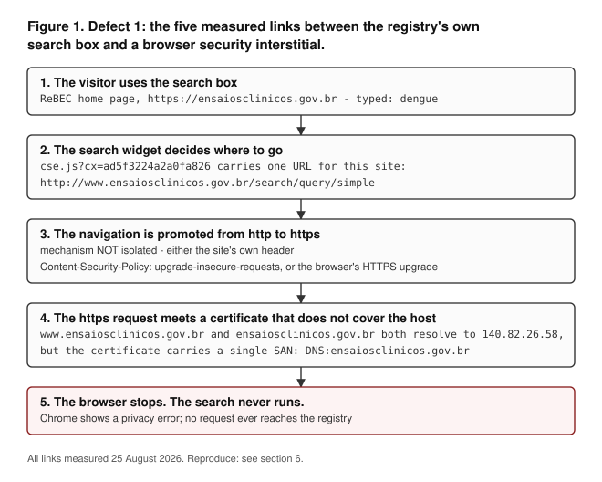

# When a trial registry outsources its own search: measured defects in the public search of ReBEC

**Carlos Ulisses Flores**
MSc candidate in Artificial Intelligence, American Global Tech University · CTO and Chief Researcher,
Codex Hash Research Laboratory, São Paulo, Brazil
ORCID [0000-0002-6034-7765](https://orcid.org/0000-0002-6034-7765) · c.ulisses@gmail.com

*Short report. All measurements taken 25 August 2026 (UTC). Code, raw responses and cryptographic
hashes are released with this report so that every number below can be re-derived or refuted.*

> **Version note.** This English text is the version of record. A full Portuguese translation is
> deposited under the same DOI; where the two diverge, this file governs.

---

## Abstract

**Background.** The Brazilian Registry of Clinical Trials (ReBEC) is a World Health Organization
(WHO) International Clinical Trials Registry Platform (ICTRP) primary registry. Systematic
reviewers, journalists, clinicians and patients search it and act on what it returns — including on
what it does *not* return.

**Methods.** We measured the public search interface of ReBEC on 25 August 2026 (UTC) by five
independent routes: (i) the served HTML of the search endpoint; (ii) the live search performed in an ordinary
desktop browser; (iii) DNS and TLS of the hosts involved; (iv) the published configuration of the
search widget; and (v) independent third-party captures held by the Internet Archive. Recall was
measured by comparing sets of trial identifiers, never by the result estimate the interface
displays. Every search used a positive control.

**Results.** The public search of ReBEC does not query the registry database. It is a Google Custom
Search over the pages of the website, executed in the visitor's browser. The defects below are not
three independent faults of the registry: **(2)** and **(3)** are what that single decision
produces, and **(1)** is where the decision meets a separate certificate configuration.
**(1)** The search box on the registry's own home page sends the visitor to a hostname
(`www.ensaiosclinicos.gov.br`) that the site's TLS certificate does not cover; in current Chrome the
search therefore ends on a browser security interstitial. **(2)** The served response does not vary
with the query string: six different query terms returned HTTP 200 with a single, byte-identical body
(69,877 bytes, one SHA-256). Filtering happens only in client-side JavaScript, so every non-JavaScript
client — scripts, harvesters, and web archives — receives a search page that never filters. **(3)**
For the term `dengue`, the registry database returns 17 trials while the public search surfaces 14 of
them (recall 14/17), of which two omissions are attributable index failures: the trial pages exist,
contain the search term, and are still not returned. Internet Archive captures show the
query-insensitive behaviour of defect 2 already present on 23 September 2025, at least 11 months
before our measurement.

**Conclusions.** A WHO ICTRP primary registry can present a search interface that looks like a
database query, is in fact a third-party web index of incomplete coverage, and fails in ways that are
invisible to the person searching. We report this as an observable property of a public system, with
no claim about intent, and we release the instruments so the finding expires the day it is fixed.

**Keywords:** clinical trial registries; ReBEC; WHO ICTRP; search interfaces; silent failure;
research infrastructure

---

## 1. Introduction

Trial registries exist so that studies can be found. That function is load-bearing: systematic
reviewers search registries to detect unpublished and ongoing studies [1]; clinicians and patients
search them to find studies they might join, and have called for search filters that registry
interfaces do not currently offer [2]; journalists and meta-researchers search them to make
claims about what a country is and is not studying. All of these uses share a property that makes
them fragile: **an empty result is informative**. "There are no registered trials on X in Brazil" is
a conclusion people draw, publish, and act on.

That inference is only valid if the search actually searched. This report measures whether it does,
for one ICTRP primary registry.

ReBEC was created to strengthen the management of clinical research in Brazil [3] (the 2009 notice
announces it under the acronym *Rebrac*) and is operated within the Brazilian public health system; it is one of the WHO ICTRP primary registries [7]. Latin
American registration practice, including Brazil's, has been studied for adherence and completeness
[4,5,6]. We found no prior report evaluating whether
a trial registry's public **search interface** returns what its database contains. The gap we
address is therefore narrow and stated as such (§4.3).

## 2. Methods

### 2.1 Design and positive controls

Every measurement pairs a **term of interest** with a **positive control** — a term known to have
records in the registry (`dengue`, `diabetes`). Without a positive control, an empty result cannot
distinguish "there is nothing" from "the search did not run"; that distinction is the entire subject
of this report.

Six terms were used against both the public interface and the registry's own data endpoint:
`dengue`, `diabetes`, `prion`, `Creutzfeldt`, `Jakob`, `priônica`.

### 2.2 Instruments and identifiers

Two command-line instruments accompany this report:

| Instrument | What it measures | Exit semantics |
|---|---|---|
| `code/measure_public_search.py` | The served response of the public search endpoint for each term; the registry's own data endpoint for the same terms | exits non-zero if the finding no longer holds |
| `code/measure_archive_timeline.py` | Internet Archive captures of the same endpoint for three different query terms | exits non-zero if the captures cease to be identical |

Both instruments record byte counts, MD5 and SHA-256 of every response, so that any reader can
verify that the artefacts distributed with this report are the responses we actually received.

The registry's own data endpoint is `/api2/api/search`, whose contract is published by the registry
itself at `/api2/openapi.json`. It follows the DataTables server-side convention, in which the global filter
parameter is `search[value]` [8]. Passing an unrecognised parameter (for example `q=`) does not raise an error; the
endpoint ignores it and returns the entire base (9,629 records on the day of measurement). This is
ordinary REST behaviour rather than a defect, but it is a trap for anyone writing a script against
this endpoint, and we note it for that reason alone.

### 2.3 Browser measurement

Defect 1 concerns what a person experiences, so it was measured in an ordinary, logged-in desktop
Chrome browser rather than by any headless automation: the search box on the registry home page was
used exactly as a visitor would use it. The result set for defect 3 was likewise enumerated from the
rendered page, paging until no new results appeared, and the enumeration was repeated in a second
independent run to test stability.

### 2.4 Recall by identifier, not by result count

The interface displays an estimate ("approximately N results"). **That estimate is unstable and we do
not use it**: the same query for `dengue` produced "approximately 38 results" on first render and
"approximately 20" on the two subsequent runs. Recall is therefore computed over **sets of trial
identifiers** (`RBR-*`), which were identical across the two independent runs, and in the standard
sense: the fraction of the relevant set that the system returns [9].

### 2.5 Statement on research conduct

Our instruments send a browser User-Agent string. This is not cosmetic and not an attempt to
misrepresent: the registry's web server returns HTTP 403 to clients that do not send one, so without
it the measurement would record "403 for everything" and would be reporting a third cause. **We did
not circumvent authentication, rate limits, or `robots.txt`.** The registry's `robots.txt` permits
`Googlebot` and `Algolia Crawler` at `/`, and disallows `/assets/`, `/uploads/` and `/matomo/` for
all agents plus `/xml_ictrp/` for generic agents; the paths we retrieved are not among the disallowed
ones. No personal data was collected. No account was created or used.

## 3. Results

### 3.1 The public search of ReBEC does not query the registry

The served HTML of the registry contains an active Google Custom Search widget
(`cse.google.com/cse.js?cx=ad5f3224a2a0fa826`): a `gcse-searchbox-only` element on the home page and
a `gcse-searchresults-only` element on the results page. The registry's earlier native search forms
are still present in the served HTML but are enclosed in HTML comments, one of them carrying the
developer's own note, *"comentando busca antiga"* ("commenting out the old search").

The consequence is structural rather than incidental: what a member of the public queries is
**Google's index of the website's pages**, not the registry's 9,629 records.

That single decision organises what follows, and we set the relation out before the measurements so
that the three are not read as three independent faults. Defect 2 (§3.3) and defect 3 (§3.4) are
consequences of it: filtering moved into the visitor's browser, and coverage became a third party's
index of pages rather than the registry's own records. Defect 1 (§3.2) is not a consequence of it
alone — it is where the configured target host of the outsourced widget meets a TLS certificate that
does not cover that host, which is a separate configuration fault. We report all three because each
was measured separately, and we subordinate them here because they do not carry equal independence.

### 3.2 Defect 1 — the registry's own search box ends on a browser security warning

Typing `dengue` into the search box on the ReBEC home page and pressing Enter navigates to
`https://www.ensaiosclinicos.gov.br/search/query/simple?q=dengue` and Chrome displays a privacy
error. The search never runs. Each link of the chain was measured independently
(Figure 1):



| Link | Measurement |
|---|---|
| The search widget is configured to send visitors to the `www` host, over `http` | `cse.js?cx=ad5f3224a2a0fa826` contains exactly one URL for this site: `http://www.ensaiosclinicos.gov.br/search/query/simple` |
| The `www` host resolves to the same server | `www.ensaiosclinicos.gov.br` → `ensaiosclinicos.gov.br` → `140.82.26.58` |
| The certificate does not cover the `www` host | The identity a TLS client must check is the certificate's `subjectAltName` [10]: here `CN=ensaiosclinicos.gov.br`, **single SAN `DNS:ensaiosclinicos.gov.br`** (Let's Encrypt, valid 4 Jul 2026 – 2 Oct 2026). `curl`: *"no alternative certificate subject name matches target host name"* |
| The server would fix this itself, if it were asked over `http` | `http://www.ensaiosclinicos.gov.br/search/query/simple?q=dengue` → **HTTP 301** → `https://ensaiosclinicos.gov.br/search/query/simple?q=dengue` |
| But the browser never asks | The navigation is made over `https` to the `www` host, so it meets the wrong certificate and stops before the server can answer. **We did not isolate which of two mechanisms performs that upgrade**, and both are present: (a) the registry itself serves `Content-Security-Policy: upgrade-insecure-requests` on the home page and on the search page, and the specification upgrades form submissions under that directive *regardless of host* [12]; or (b) the browser's own automatic HTTPS upgrade. No HSTS [11] preloading is involved: `hstspreload.org` reports status `unknown` for both `gov.br` and `ensaiosclinicos.gov.br` |

A visitor who reaches the canonical host directly — by editing the URL, or following a link that does
not pass through the search box — does get results. The defect is in the path the registry itself
offers.

### 3.3 Defect 2 — the served response does not vary with the query, so every non-JavaScript client sees a search that never filters

On the canonical host, the search endpoint returned **HTTP 200 with a byte-identical body for all six
terms**: 69,877 bytes, a single SHA-256 (`bbf0281011e6a783334172b4b1b94e415d08bcda97cabf26480dd5ad2cf47946`),
while the registry's own data endpoint discriminated between the same terms on the same day:

| Term | Public search: HTTP | Public search: body (bytes) | Public search: SHA-256 | Registry database: records (of 9,629) |
|---|---|---|---|---|
| `dengue` | 200 | 69,877 | `bbf0281…f47946` | 17 |
| `diabetes` | 200 | 69,877 | `bbf0281…f47946` | 1,452 |
| `prion` | 200 | 69,877 | `bbf0281…f47946` | 1 |
| `Creutzfeldt` | 200 | 69,877 | `bbf0281…f47946` | 0 |
| `Jakob` | 200 | 69,877 | `bbf0281…f47946` | 0 |
| `priônica` | 200 | 69,877 | `bbf0281…f47946` | 0 |

The left three columns do not vary; the right one does. That contrast is the defect.

HTTP 200 is not itself the defect: it is the correct status for a page that renders a form. What we
measured is the served body, and it does not vary with the query string; we make no claim about how
the server handles the parameter internally, only that nothing of it reaches the response. The
defect is that the page presents itself as a search result, is reachable with a query string, and
never filters server-side. Because filtering happens only in client-side JavaScript, **every client
that does not execute JavaScript — command-line tools, harvesters, and web archives — receives a
search page that silently ignores the question it was asked.**

### 3.4 Defect 3 — what the public search returns is not what the registry holds

Measured for `dengue`, by identifier:

| Source | Result |
|---|---|
| Registry database (`/api2/api/search`, `search[value]=dengue`) | **17 trials** |
| Public search (Google Custom Search, rendered in Chrome, paged to exhaustion) | **16 distinct `RBR-` identifiers** |
| Intersection | **14** |
| **Recall** | **14/17** |

The three trials the public search did not surface were inspected individually:

- **`RBR-69pf3b`** and **`RBR-7gstxs6`** — the public trial page exists (HTTP 200) **and contains the
  word `dengue`**, and the registry's own search still does not return it. These are attributable
  index failures.
- **`RBR-5vpyh4`** — the public page exists but does **not** contain the term; the database matched on
  a field that the public page does not display. A text index could not have found it. We do **not**
  count this as an index failure; it is a different problem (what the database indexes is not what
  the page publishes), and we report it rather than absorb it into the headline number.

Two identifiers went the other way (`RBR-7jmj48v`, `RBR-84nk5q6`): surfaced by the public search,
not returned by the database filter for that term, and their pages do not contain the term. The
divergence therefore runs in both directions, and we report both — but they are not the same
quantity. The three trials the search omits are a **recall** failure; the two it surfaces outside
the database's own filter for that term are a **precision** failure. We measured only the first.
The distinction is the standard one in information retrieval [9], and it has a sharp edge here: an
interface backed by a web index over pages returns *something* for almost any query, which reads as
responsiveness while leaving recall unmeasured — and, by the interface's own design, unmeasurable
from the outside without a second source to compare against.

The six terms above were also run through the browser path. `dengue` and `diabetes` returned results;
`prion`, `Creutzfeldt`, `Jakob`, `priônica`, `doença priônica` and `príon` returned *"A pesquisa não
encontrou resultados"*. The single `prion` hit at the data endpoint is a substring false positive
(`RBR-3w2scz`, a smoking-cessation trial), confirmed by opening the record. For this class of terms
the two independent routes agree.

### 3.5 Duration: the behaviour is not a maintenance window

The Internet Archive captured three different queries to the same endpoint on **23 September 2025**,
within two minutes of one another: `?q=crohn` (17:08:18 UTC), `?q=artrite psoriática` (17:09:46 UTC)
and `?q=psoriatic arthritis` (17:09:59 UTC). **All three captures are byte-identical** (66,525 bytes,
SHA-256 `e47f39fbc73fede9f75e40ac37013d610581b4866f54d923b8f46cb76dbfca16`), and none of them
contains the term that was searched. The archive's own CDX index records a single digest for the
three, independently of our retrieval.

Defect 2 therefore holds at two measured points **11 months apart** (23 Sep 2025 and 25 Aug 2026).
We claim persistence between those two points and not continuity across the interval, and the
distinction is in the data rather than in caution: the only archived captures of this endpoint that
carry a query string are the three of 23 September 2025. The intermediate captures the archive holds
(4 Apr 2025, 13 Sep 2025, 13 Nov 2025, 20 Feb 2026) are *bare* — retrieved without `?q=` — so they
cannot test whether different terms return the same response, and their CDX digests differ from one
another for that reason. We therefore do not offer them as corroboration, and an earlier draft of
this report that described them as consistent and uncontradicted overstated what they can show. The
start date is unknown and, for a specific reason, unrecoverable: an earlier capture (5 June 2024) shows a client-side search widget,
and a web archive does not preserve what JavaScript rendered. **We therefore do not claim that the
search never worked.**

## 4. Discussion

### 4.1 What this means for people who search registries

Whoever reaches the registry's records through this interface is searching a third-party web index of
the registry's pages, with coverage that is measurable and, in our one measured case, incomplete. The
failure is fail-silent rather than fail-fast: nothing in the response tells the caller that the
question was never put to the database. A reader cannot tell this from the interface, and the method
sections of downstream work cannot record a distinction they were never shown.

**We did not measure who arrives by this route, and that limit is sharper than it looks.** The same
records are aggregated by the WHO ICTRP portal, which we did not measure; the methodological review
most relevant to registry searching [1] searched the ICTRP portal rather than the national site. So
a systematic review that records "we searched ReBEC" may or may not have passed through the
interface measured here, and we do not claim that it did. As a crude indication of how much work
sits somewhere downstream of this registry, Europe PMC returns 2,798 records mentioning "ReBEC",
1,234 mentioning "Brazilian Registry of Clinical Trials" and 494 mentioning "ensaiosclinicos.gov.br"
(25 Aug 2026). **These are co-occurrence counts, not verified claims of having searched, still less
of having searched by this route, and we deliberately do not convert them into an estimate of
harm.**

The archival consequence is separate and worse, because it is silent and permanent: what the Internet
Archive holds for this endpoint is a search page that never filtered. Anyone reconstructing, years
from now, what the Brazilian registry could be searched for will find query-insensitive pages.

### 4.2 What this report does not claim

It makes no claim about intent, negligence or fault. It describes observable properties of a public
system on a stated date. It does not claim that ReBEC's *records* are incomplete — the database
answered every query we put to it. It does not claim the search is unusable: on the canonical host,
in a browser, it works. It does not claim to know by which route people reach ReBEC's records — the
WHO ICTRP portal carries the same records and was not measured here. And it does not generalise
defect 1 beyond current Chrome.

### 4.3 Limitations, stated rather than discovered by the reader

1. **One browser, and one unisolated mechanism.** Defect 1 was observed in current Chrome; Firefox
   and Safari were not tested. More importantly, we did not determine *which* mechanism performs the
   `http`→`https` upgrade (§3.2). This matters in the direction that makes our claim conservative:
   if the upgrade is performed by the registry's own `upgrade-insecure-requests` header, the defect
   is not browser-specific and would reproduce in any conforming browser. We report the header as
   measured and the attribution as open, rather than claiming either.
2. **One term for recall.** Recall was measured for `dengue` (17 records). It does not scale by this
   route: the search element returns at most about one hundred results, so recall for a term such as
   `diabetes` (1,452 records) is not measurable this way. The strong number in this report comes from
   a small case, and that is a real limit.
3. **Unknown start date**, for the reason given in §3.5.
4. **Response size varies between days.** An earlier measurement of ours recorded 69,876 bytes and a
   different MD5 from the 69,877 bytes reported here. The identity that matters is **between terms
   within a single run**; **between days** the body changes because the page footer carries live
   counters. We state this because a reader comparing our two datasets would otherwise find the
   discrepancy and be right to distrust the rest.
5. **One registry.** The obvious next step, which we did not take, is to run this same two-armed
   protocol (positive control + response-identity test) against the other ICTRP primary registries
   and publish the census — how many discriminate, how many fail silently, and for how many the
   protocol does not apply. That is what would turn a single measured case into a survey.
6. **Prior-art search.** Europe PMC and Crossref were searched in English, and SciELO in Portuguese.
   The claim of novelty is correspondingly narrow: we found no prior report evaluating whether a
   trial registry's public search returns what its database holds.

### 4.4 Future directions

Three steps follow from the limits above, and none of them was taken here: (i) run the same
two-armed protocol — positive control plus response-identity test — against the remaining ICTRP
primary registries and publish the census, which is what would turn one measured case into a survey;
(ii) replicate defect 1 in Firefox and Safari and isolate which mechanism performs the `http`→`https`
upgrade, by instrumenting the form submission itself rather than a programmatic click, which is the
measurement that would close the open attribution in §3.2; and (iii) measure the downstream
consequence directly, by sampling systematic reviews that record having searched ReBEC, establishing
by which route they searched, and checking whether the trials the public search omits are the ones
those reviews missed — replacing the co-occurrence counts of §4.1 with an effect.

## 5. Notification

**Notification precedes deposit.** This report was sent in Portuguese to the registry's operator
(ReBEC, operated within ICICT/Fiocruz) on **25 August 2026 (UTC)**, before deposit, at two addresses:
the one the registry publishes on its own site, and `sic@fiocruz.br`, the institutional Citizen
Information Service of the operating foundation, verified on the foundation's own
access-to-information page on the same date. The notice carried this text and its SHA-256, and said
plainly that deposit was imminent. **No response was awaited, and none is treated as consent**: the
purpose of notifying first is that the operator should not learn from a permanent identifier that a
report naming their system exists.

We do not claim a receipt we do not hold. **No formal request under the Brazilian access-to-information
statute was filed**, and therefore no dated government protocol number accompanies this section: that
route runs through a platform requiring an authenticated national-identity account, which is a
personal credential rather than an instrument of this report. What exists is the sent message, on the
stated date, to the two addresses above. A reader weighing this should weigh it as that and nothing
more.

Notice did not go to a computer security response team. The finding in §3.2 is a certificate-coverage
fault on a hostname that redirects to the covered one; it exposes no primitive an attacker gains
from, so treating it as a vulnerability report would misdescribe it and would escalate over the
operator. Escalation remains conditional and is stated as such: it would follow only from a
persistent failure to reach anyone, which notification at an institutional address is meant to
prevent. The WHO ICTRP was not notified as a disclosure counterparty; it is named in this report only
as the platform whose primary registry this is.

Should the interface be repaired, both instruments in this report exit non-zero, and the repair — not
this report — becomes the outcome of record. That is the intended end of this finding, and the reason
the notification carries a date: a reader comparing the repair to this text should be able to tell
"fixed after being told" from "never true".

## 6. Data and code availability

All instruments, raw responses, and hashes are released with this report. The two central claims are
falsifiable in one command each:

```bash
python3 code/measure_public_search.py        # defect 2, live; exit 1 if the search starts filtering
python3 code/measure_archive_timeline.py     # duration, via the Internet Archive; exit 1 if captures diverge
python3 code/measure_downstream_mentions.py  # the three co-occurrence counts of section 4.1
python3 code/make_figure.py                  # regenerates Figure 1 from the facts above

# defect 1, without a browser:
curl -s "https://cse.google.com/cse.js?cx=ad5f3224a2a0fa826" | grep -o "http://www.ensaiosclinicos[^\"]*"
echo | openssl s_client -connect www.ensaiosclinicos.gov.br:443 \
  -servername www.ensaiosclinicos.gov.br 2>/dev/null | openssl x509 -noout -ext subjectAltName
```

| Artefact | SHA-256 |
|---|---|
| `code/measure_public_search.py` | `b4add151376bdef07ee418ba5400b1f830d7b8575fbef0f413f829df5a0dddd4` |
| `output/public-search-vs-database.json` | `0be693fab53218e0b0e132e10ff8a253129ed36fd7e64550eb72e6ae54aa4843` |
| `code/measure_archive_timeline.py` | `fce57db0cb38d5cd0f93b8ce9efce67ca86f3679d062430f811d0298e8e47196` |
| `output/archive-timeline.json` | `b6e1d54f7a5024041ab9415390b30688379fb79584d1f1a1bcd04664f689bd48` |
| `code/measure_downstream_mentions.py` | `4bb8eac8e611e1fdc9eb4be069a7a353a9a8a3eb13449fb25a8411714bcd6e3f` |
| `output/downstream-mentions.json` | `41bf770d7fb2ea305fb4e7798b88bf682577a6a4a78fcee219c789f86444b9a6` |
| `code/make_figure.py` | `1492ac993f36c8bf1475fc9ca468c3649f5c584f4155947a680dc56b3f404d51` |
| `output/figures/fig1-defect1-chain.svg` | `bcf498856d53fa732157583bae3daddb40ec2e55951655f18e14a95b5c601e8e` |
| `output/figures/fig1-defect1-chain-pt.svg` | `c19027caa66c82a20906c75bf36eeb08f4496cba0c9661d66274b24eff097506` |
| public search response, all six terms, 25 Aug 2026 | `bbf0281011e6a783334172b4b1b94e415d08bcda97cabf26480dd5ad2cf47946` |
| Internet Archive captures, all three terms, 23 Sep 2025 | `e47f39fbc73fede9f75e40ac37013d610581b4866f54d923b8f46cb76dbfca16` |

## References

1. Baudard M, Yavchitz A, Ravaud P, Perrodeau E, Boutron I. Impact of searching clinical trial
   registries in systematic reviews of pharmaceutical treatments: methodological systematic review
   and reanalysis of meta-analyses. *BMJ* 2017;356:j448. doi:10.1136/bmj.j448 · PMID 28213479
2. Woolley KL, Woolley JD, Woolley MJ. Seek and ye shall not find (yet): searching clinical trial
   registries for trials designed with patients — a call to action. *J Particip Med*
   2025;17:e72015. doi:10.2196/72015 · PMID 40446325
3. Departamento de Ciência e Tecnologia, Secretaria de Ciência, Tecnologia e Insumos Estratégicos,
   Ministério da Saúde. [Brazilian Registry of Clinical Trials (Rebrac): strengthening of clinical
   trials management in Brazil]. *Rev Saude Publica* 2009;43(2):387-388.
   doi:10.1590/s0034-89102009000200024 · PMID 19287881 — the 2009 notice announces the registry
   under the acronym *Rebrac*; it is the registry now known as ReBEC.
4. García-Vello P, Smith E, Elias V, Florez-Pinzon C, Reveiz L. Adherence to clinical trial
   registration in countries of Latin America and the Caribbean, 2015. *Rev Panam Salud Publica*
   2018;42:e44. doi:10.26633/rpsp.2018.44 · PMID 31093072
5. Rodríguez-Feria P, Cuervo LG. Progress in trial registration in Latin America and the Caribbean,
   2007-2013. *Rev Panam Salud Publica* 2017;41:e31. doi:10.26633/rpsp.2017.31 · PMID 31363353
6. Freitas CG, Pesavento TF, Pedrosa MR, Riera R, Torloni MR. Practical and conceptual issues of
   clinical trial registration for Brazilian researchers. *Sao Paulo Med J* 2016;134:28-33.
   doi:10.1590/1516-3180.2014.00441803 · PMID 26313113
7. World Health Organization. International Clinical Trials Registry Platform (ICTRP): primary
   registries. https://www.who.int/clinical-trials-registry-platform
8. SpryMedia Ltd. *DataTables manual: server-side processing.*
   https://datatables.net/manual/server-side — defines `search[value]` as the global search value
   sent to the server.
9. Manning CD, Raghavan P, Schütze H. *Introduction to Information Retrieval.* Cambridge:
   Cambridge University Press; 2008. doi:10.1017/CBO9780511809071 · ISBN 9780521865715
10. Saint-Andre P, Salz R. *Service Identity in TLS.* RFC 9525, November 2023.
   doi:10.17487/RFC9525 — obsoletes RFC 6125; the client matches the presented identity against the
   certificate's `subjectAltName`.
11. Hodges J, Jackson C, Barth A. *HTTP Strict Transport Security (HSTS).* RFC 6797, November 2012.
   doi:10.17487/RFC6797
12. West M, editor. *Upgrade Insecure Requests.* W3C Candidate Recommendation.
   https://www.w3.org/TR/upgrade-insecure-requests/ — §4.1 upgrades form submissions irrespective of
   host, while other top-level navigations are upgraded only for hosts in the client's upgrade
   insecure navigations set.
## Funding, conflicts of interest, and use of automated tools

No funding was received for this work. The author declares no competing interests, and no
relationship of any kind with ReBEC, Fiocruz, or Google.

The measurements were designed, executed and verified by the author, with large language models used
as assistants for search breadth and drafting. Nothing in this report rests on that assistance: every
number is produced by a released instrument or a single reproducible command, and three of the
author's own conclusions were refuted during adversarial checking and corrected before deposit —
most consequentially, an earlier and broader version of this finding, which asserted that a person
using the public search would find nothing, was withdrawn after the browser measurement in §3.2
showed it to be false.
