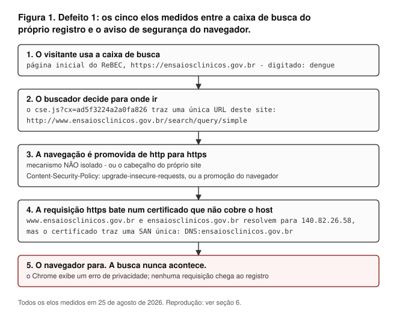

# Quando um registro de ensaios clínicos terceiriza a própria busca: defeitos medidos na busca pública do ReBEC

**Carlos Ulisses Flores**
Mestrando em Inteligência Artificial, American Global Tech University · CTO e Chief Researcher,
Codex Hash Research Laboratory, São Paulo, Brasil
ORCID [0000-0002-6034-7765](https://orcid.org/0000-0002-6034-7765) · c.ulisses@gmail.com

*Relato curto. Todas as medições em 25 de agosto de 2026 (UTC). Código, respostas brutas e hashes
criptográficos acompanham este relato para que cada número abaixo possa ser refeito — ou refutado.*

DOI de conceito (todas as versões) [10.5281/zenodo.22102596](https://doi.org/10.5281/zenodo.22102596) ·
repositório [github.com/ulissesflores/rebec-search-fidelity](https://github.com/ulissesflores/rebec-search-fidelity)

> **Nota de versão.** Esta é a tradução integral, para o português, do texto depositado em inglês sob
> o mesmo DOI. Em caso de divergência, a versão em inglês é a de registro.

---

## Resumo

**Contexto.** O Registro Brasileiro de Ensaios Clínicos (ReBEC) é um registro primário da Plataforma
Internacional de Registros de Ensaios Clínicos (ICTRP) da Organização Mundial da Saúde. Revisores
sistemáticos, jornalistas, profissionais de saúde e pacientes buscam nele e agem com base no que ele
devolve — inclusive com base no que ele **não** devolve. Este relato mede essa interface e conclui
que ela não consulta o banco do registro.

**Método.** Medimos a busca pública do ReBEC em 25 de agosto de 2026 (UTC) por cinco rotas
independentes:
(i) o HTML servido pelo endpoint de busca; (ii) a busca feita ao vivo num navegador comum;
(iii) DNS e TLS dos hosts envolvidos; (iv) a configuração publicada do buscador; e (v) capturas
independentes de terceiro, feitas pelo Internet Archive. O recall foi medido comparando **conjuntos
de identificadores** de ensaios, nunca pela estimativa de resultados que a interface exibe. Toda
busca usou controle positivo.

**Resultados.** A busca pública do ReBEC **não consulta o banco do registro**. Ela é um Google Custom
Search sobre as páginas do site, executado no navegador do visitante. Os defeitos abaixo não são três
faltas independentes do registro: **(2)** e **(3)** são o que essa decisão única produz, e **(1)** é
onde ela encontra uma configuração de certificado à parte.
**(1)** A caixa de busca da própria página inicial envia o visitante a um nome de host
(`www.ensaiosclinicos.gov.br`) que o certificado TLS do site não cobre; no Chrome atual, a busca
terminava, na data medida, num aviso de segurança do navegador; este defeito foi consertado ainda no
mesmo dia, e o conserto está registrado, datado e medido, na §5.1. **(2)** A resposta servida não
varia com a consulta:
seis termos diferentes devolveram HTTP 200 com um corpo byte a byte idêntico (69.877 bytes, um único
SHA-256). A filtragem ocorre apenas em JavaScript no cliente — logo, todo cliente sem JavaScript
(scripts, coletores e arquivos da web) recebe uma página de busca que nunca filtra. **(3)** Para o
termo `dengue`, o banco devolve 17 ensaios e a busca pública entrega 14 deles (recall 14/17); duas
das ausências são falhas de índice atribuíveis: a página do ensaio existe, contém o termo buscado, e
ainda assim não é devolvida. Capturas do Internet Archive mostram o comportamento do defeito 2 já
presente em 23 de setembro de 2025, onze meses antes da nossa medição — dois pontos medidos, não
uma série contínua.

**Conclusões.** Um registro primário do ICTRP pode apresentar uma busca que parece consulta a banco de
dados, é na verdade um índice de terceiro com cobertura incompleta, e falha de maneiras invisíveis a
quem busca. Relatamos isso como propriedade observável de um sistema público, sem nenhuma afirmação
sobre intenção, e liberamos os instrumentos para que o achado expire no dia em que for corrigido.

**Palavras-chave:** registros de ensaios clínicos; ReBEC; ICTRP/OMS; interfaces de busca;
falha silenciosa; infraestrutura de pesquisa

---

## 1. Introdução

Registros de ensaios existem para que estudos possam ser encontrados e — sob a orientação atualizada
da Organização Mundial da Saúde — para que seus resultados sumários possam ser lidos ali [1]. Essa
função sustenta peso: revisores sistemáticos buscam registros para detectar estudos não publicados e
em andamento [2], prática frequente o bastante para ser medida dentro de uma única especialidade
cirúrgica [3]; profissionais e pacientes buscam para achar estudos dos quais possam participar — e
pedem filtros de busca que as interfaces dos registros hoje não oferecem [4]; jornalistas e
meta-pesquisadores buscam para afirmar o que um país, ou uma área, está — e o que não está —
estudando [5]. Todos esses usos compartilham uma propriedade que os torna frágeis: **um resultado
vazio informa**. "Não há ensaios registrados sobre X no Brasil" é uma conclusão que se tira, se
publica e sobre a qual se age — e, no ReBEC, um registro primário do ICTRP/OMS, **essa conclusão não
se apoia em nada, porque a busca pública do registro nunca consulta o banco do registro**. O que ela
consulta é um índice web de terceiro sobre as páginas do próprio registro, e a filtragem que ela faz
acontece no navegador do visitante.

Essa inferência só é válida se a busca de fato buscou — afirmação falsificável, e é ela que este
relato mede. Enunciamos o desfecho antes dos resultados porque os três defeitos abaixo não são três
falhas independentes: dois deles são o que aquela decisão única produz, e o terceiro é onde a decisão
encontra uma configuração de certificado separada.

O ReBEC foi criado para fortalecer a gestão da pesquisa clínica no Brasil [6] (o comunicado de 2009 o
anuncia sob a sigla *Rebrac*) e é operado dentro do sistema público de saúde brasileiro; é um dos
registros primários do ICTRP/OMS [7]. A prática de registro na América Latina, inclusive a
brasileira, já foi estudada quanto a adesão e completude [8,9,10], e a meta-pesquisa sobre registros
em geral se concentrou no *conteúdo* das entradas — tipicamente na concordância delas com o artigo
que as sucede [11,12,13]. **Não encontramos relato anterior avaliando se a interface de busca de um
registro de ensaios devolve aquilo que o banco dele contém.** A lacuna que atacamos é, portanto,
estreita — e assim declarada (§4.3).

## 2. Método

### 2.1 Desenho e controles positivos

Toda medição pareia um **termo de interesse** com um **controle positivo** — um termo que sabidamente
tem registros na base (`dengue`, `diabetes`). Sem controle positivo, um resultado vazio não
discrimina "não há nada" de "a busca não rodou"; e essa distinção é o objeto inteiro deste relato.
Os dois controles foram fixados antes das medições, não escolhidos post hoc.

Foram **8 termos** ao todo, em dois conjuntos que este relato mantém distintos. **6** deles —
`dengue`, `diabetes`, `prion`, `Creutzfeldt`, `Jakob`, `priônica` — rodaram contra a interface
pública e contra o endpoint de dados do próprio registro, e são o conjunto por trás do defeito 2
(§3.3). O braço de navegador da §3.4 acrescentou **2**, `doença priônica` e `príon`, para os quais
não houve medição no endpoint de dados.

### 2.2 Instrumentos e identificadores

Três instrumentos de linha de comando acompanham este relato, um por defeito:

| Instrumento | O que mede |
|---|---|
| `code/measure_public_search.py` | A resposta servida pelo endpoint de busca pública para cada termo; e o endpoint de dados do registro para os mesmos termos |
| `code/measure_archive_timeline.py` | Capturas do Internet Archive do mesmo endpoint para três termos diferentes |
| `code/measure_defect1_tls.py` | Os dois elos do defeito 1: a URL que a configuração publicada do buscador nomeia para este site, e se o certificado servido para aquele host o cobre |

Eles compartilham uma convenção de saída, e ela é o argumento da §2.1 aplicado aos instrumentos do
próprio relato — uma medição que falhou nunca pode ser lida como resultado negativo:

| Código de saída | Significado |
|---|---|
| `0` | o achado valeu nesta execução |
| `1` | a medição foi válida e o achado **não** valeu — o defeito pode ter sido consertado |
| `2` | a medição não pôde ser feita, o que não diz absolutamente nada sobre o achado |

A validade é decidida *antes* do veredito: o `measure_public_search.py` declara a execução inválida se
alguma requisição não se completou ou se um controle positivo volta sem registros, e nesse caso grava
`finding_confirmed: null`, não `false`. Reexecutar qualquer instrumento escreve em `output/reruns/`,
nunca por cima do JSON selado cujo hash este relato publica.

Os três registram tamanho em bytes, MD5 e SHA-256 de cada resposta, de modo que qualquer leitor possa
verificar que os artefatos distribuídos aqui são as respostas que de fato recebemos.

O endpoint de dados do registro é `/api2/api/search`, cujo contrato o próprio registro publica em
`/api2/openapi.json`. Ele segue a convenção DataTables de processamento no servidor, na qual o
parâmetro de filtro global chama-se `search[value]` [14]. Passar um parâmetro não reconhecido (por exemplo `q=`) não gera erro; o endpoint o
ignora e devolve a base inteira (9.629 registros no dia da medição). Isso é comportamento REST
ordinário, não defeito — mas é armadilha para quem escreve script contra esse endpoint, e é só por
isso que registramos.

### 2.3 Medição no navegador

O defeito 1 diz respeito ao que uma pessoa vive, então foi medido num Chrome comum de desktop,
logado, e não por automação headless: a caixa de busca da página inicial foi usada exatamente como um
visitante a usaria. O conjunto de resultados do defeito 3 também foi enumerado a partir da página
renderizada, paginando até esgotar, e a enumeração foi repetida numa segunda execução independente
para testar estabilidade.

### 2.4 Recall por identificador, não pelo número exibido

A interface mostra uma estimativa ("aproximadamente N resultados"). **Essa estimativa é instável e não
a usamos**: a mesma consulta por `dengue` devolveu "aproximadamente 38 resultados" na primeira
renderização e "aproximadamente 20" nas duas execuções seguintes. O recall é, portanto, calculado
sobre **conjuntos de identificadores** de ensaio (`RBR-*`) — idênticos nas duas execuções
independentes — e no sentido corrente: a fração do conjunto relevante que o sistema devolve [15].

### 2.5 Declaração de conduta de pesquisa

Nossos instrumentos enviam um User-Agent de navegador. Isso não é cosmético nem tentativa de se fazer
passar por outra coisa: o servidor do registro devolve HTTP 403 a clientes que não enviam um, de modo
que sem isso a medição registraria "403 para tudo" e estaria relatando uma terceira causa. **Não
contornamos autenticação, limite de taxa nem `robots.txt`.** O `robots.txt` do registro permite
`Googlebot` e `Algolia Crawler` em `/`, e proíbe `/assets/`, `/uploads/` e `/matomo/` para todos os
agentes, mais `/xml_ictrp/` para agentes genéricos; os caminhos que acessamos não estão entre os
proibidos. Nenhum dado pessoal foi coletado. Nenhuma conta foi criada ou usada.

## 3. Resultados

### 3.1 A busca pública do ReBEC não consulta o registro

O HTML servido pelo registro traz um widget ativo do Google Custom Search
(`cse.google.com/cse.js?cx=ad5f3224a2a0fa826`): um elemento `gcse-searchbox-only` na página inicial e
um `gcse-searchresults-only` na página de resultado. Os formulários nativos anteriores do registro
continuam presentes no HTML servido, mas **dentro de comentários HTML** — um deles com a anotação do
próprio desenvolvedor: *"comentando busca antiga"*.

A consequência é estrutural, não incidental: o que o público consulta é o **índice do Google sobre as
páginas do site**, e não os 9.629 registros da base. A busca de facto de um registro primário do
ICTRP/OMS é o índice de um terceiro sobre as páginas web do próprio registro.

Essa decisão única organiza o que vem a seguir, e declaramos a relação antes das medições para que os
três não sejam lidos como três faltas independentes. O defeito 2 (§3.3) e o defeito 3 (§3.4) são
consequência dela: a filtragem passou para o navegador do visitante, e a cobertura passou a ser o
índice de um terceiro sobre páginas, não os registros do próprio registro. O defeito 1 (§3.2) não
decorre só dela — é onde o host de destino configurado no buscador terceirizado encontra um
certificado TLS que não cobre esse host, o que é uma falha de configuração à parte. Relatamos os três
porque cada um foi medido separadamente, e os subordinamos aqui porque não têm a mesma independência.

### 3.2 Defeito 1 — a caixa de busca do próprio registro termina num aviso de segurança

> **Este defeito foi consertado depois da medição.** Tudo nesta seção é o que foi observado em 25 de
> agosto de 2026 e fica como foi medido; o certificado servido para o host `www` mudou ainda naquele
> dia e não produz mais o interstício. O registro datado está na §5.1.

Digitar `dengue` na caixa de busca da página inicial do ReBEC e teclar Enter leva a
`https://www.ensaiosclinicos.gov.br/search/query/simple?q=dengue`, e o Chrome exibe um erro de
privacidade. A busca nunca acontece. Cada elo da cadeia foi medido de forma independente
(Figura 1):



| Elo | Medição |
|---|---|
| O buscador está configurado para mandar o visitante ao host `www`, em `http` | O `cse.js?cx=ad5f3224a2a0fa826` contém exatamente uma URL deste site: `http://www.ensaiosclinicos.gov.br/search/query/simple` |
| O host `www` resolve para o mesmo servidor | `www.ensaiosclinicos.gov.br` -> `ensaiosclinicos.gov.br` -> `140.82.26.58` |
| O certificado não cobre o host `www` | A identidade que um cliente TLS precisa conferir é o `subjectAltName` do certificado [16]: aqui `CN=ensaiosclinicos.gov.br`, **SAN única `DNS:ensaiosclinicos.gov.br`** (Let's Encrypt, válido de 04/07/2026 a 02/10/2026). O `curl` recusa: *"no alternative certificate subject name matches target host name"* |
| O servidor corrigiria sozinho, se fosse consultado em `http` | `http://www.ensaiosclinicos.gov.br/search/query/simple?q=dengue` -> **HTTP 301** -> `https://ensaiosclinicos.gov.br/search/query/simple?q=dengue` |
| Mas o navegador nunca chega a perguntar | A navegação sai em `https` para o host `www`, bate no certificado errado e para antes que o servidor possa responder. **Não isolamos qual dos dois mecanismos faz essa promoção**, e os dois estão presentes: (a) o próprio registro serve `Content-Security-Policy: upgrade-insecure-requests` na página inicial e na página de busca, e a norma promove submissões de formulário sob essa diretiva **independentemente do host** [17]; ou (b) a promoção automática de HTTPS do próprio navegador, que promove navegações de quadro principal de modo otimista e só volta a `http` quando a promoção falha [18]. Não há preload de HSTS [19] envolvido: o `hstspreload.org` reporta status `unknown` tanto para `gov.br` quanto para `ensaiosclinicos.gov.br` |

Um visitante que chegue diretamente ao host canônico — editando a URL, ou seguindo um link que não
passe pela caixa de busca — obtém resultados. O defeito está no caminho que o próprio registro
oferece.

### 3.3 Defeito 2 — a resposta servida não varia com a consulta, e todo cliente sem JavaScript vê uma busca que nunca filtra

No host canônico, o endpoint de busca devolveu **HTTP 200 com corpo byte a byte idêntico para os seis
termos**: 69.877 bytes, um único SHA-256
(`bbf0281011e6a783334172b4b1b94e415d08bcda97cabf26480dd5ad2cf47946`), enquanto o endpoint de dados do
próprio registro discriminou entre os mesmos termos no mesmo dia:

| Termo | Busca pública: HTTP | Busca pública: corpo (bytes) | Busca pública: SHA-256 | Banco do registro: registros (de 9.629) |
|---|---|---|---|---|
| `dengue` | 200 | 69.877 | `bbf0281…f47946` | 17 |
| `diabetes` | 200 | 69.877 | `bbf0281…f47946` | 1.452 |
| `prion` | 200 | 69.877 | `bbf0281…f47946` | 1 |
| `Creutzfeldt` | 200 | 69.877 | `bbf0281…f47946` | 0 |
| `Jakob` | 200 | 69.877 | `bbf0281…f47946` | 0 |
| `priônica` | 200 | 69.877 | `bbf0281…f47946` | 0 |

As três colunas da esquerda não variam; a da direita varia. Esse contraste é o defeito.

**HTTP 200 não é, ele mesmo, o defeito**: é o código correto para uma página que renderiza um
formulário. O que medimos é o corpo servido, e ele não varia com a consulta na URL; não afirmamos
nada sobre como o servidor trata o parâmetro internamente, apenas que nada dele chega à resposta. O
defeito é a página se apresentar como resultado de busca, ser alcançável com uma consulta na URL, e
nunca filtrar do lado do servidor. Como a filtragem só acontece em JavaScript no
cliente, **todo cliente que não executa JavaScript — ferramentas de linha de comando, coletores e
arquivos da web — recebe uma página de busca que ignora em silêncio a pergunta que lhe foi feita.**
Para coletores de arquivamento isso é um compromisso documentado, não um descuido: um coletor sem
navegador é barato e perde tudo o que só aparece depois que os scripts rodam [20].

### 3.4 Defeito 3 — o que a busca pública entrega não é o que o registro tem

Medido para `dengue`, por identificador:

| Fonte | Resultado |
|---|---|
| Banco do registro (`/api2/api/search`, `search[value]=dengue`) | **17 ensaios** |
| Busca pública (Google Custom Search, no Chrome, paginada até esgotar) | **16 identificadores `RBR-` distintos** |
| Interseção | **14** |
| **Recall** | **14/17** |

Os três ensaios que a busca pública não entregou foram inspecionados um a um:

- **`RBR-69pf3b`** e **`RBR-7gstxs6`** — a página pública do ensaio existe (HTTP 200) **e contém a
  palavra `dengue`**, e mesmo assim a busca pública não a devolve. São falhas de índice
  atribuíveis.
- **`RBR-5vpyh4`** — a página existe, mas **não** contém o termo; o banco casou por um campo que a
  página pública não exibe. Um índice de texto não teria como achar. **Não** contamos como falha de
  índice: é outro problema (o que o banco indexa não é o que a página publica), e o relatamos em vez
  de dissolvê-lo no número principal.

Dois identificadores foram na direção oposta (`RBR-7jmj48v`, `RBR-84nk5q6`): entregues pela busca
pública, não devolvidos pelo filtro do banco para aquele termo, e suas páginas não contêm o termo. A
divergência, portanto, corre nos dois sentidos, e relatamos os dois — mas não são a mesma grandeza.
Os três ensaios que a busca omite são falha de **recall**; os dois que ela entrega fora do filtro do
banco para aquele termo são falha de **precisão**. Medimos só a primeira. A distinção é a corrente
em recuperação de informação [15], e aqui ela tem um fio: uma interface apoiada num índice web sobre
páginas devolve *alguma coisa* para quase qualquer consulta, o que se lê como responsividade
enquanto deixa o recall não medido — e, pelo próprio desenho da interface, não mensurável de fora
sem uma segunda fonte com que comparar.

Todos os **8** termos foram rodados pela via do navegador. `dengue` e `diabetes` devolveram
resultados; `prion`, `Creutzfeldt`, `Jakob`, `priônica`, `doença priônica` e `príon` devolveram *"A
pesquisa não encontrou resultados"*. O único acerto de `prion` no endpoint de dados é falso positivo
por subcadeia (`RBR-3w2scz`, ensaio de cessação de tabagismo), confirmado abrindo o registro. Para
essa classe de termos, as duas rotas independentes concordam.

### 3.5 Duração: o comportamento não é uma janela de manutenção

O Internet Archive capturou três consultas diferentes ao mesmo endpoint em **23 de setembro de 2025**,
com dois minutos de intervalo entre elas: `?q=crohn` (17:08:18 UTC), `?q=artrite psoriática`
(17:09:46 UTC) e `?q=psoriatic arthritis` (17:09:59 UTC). **As três capturas são byte a byte
idênticas** (66.525 bytes, SHA-256
`e47f39fbc73fede9f75e40ac37013d610581b4866f54d923b8f46cb76dbfca16`), e nenhuma delas contém o termo
que foi buscado. O índice CDX do próprio arquivo registra um único digest para as três,
independentemente do nosso download.

O defeito 2, portanto, se sustenta em dois pontos medidos separados por **11 meses** (23/09/2025 e
25/08/2026). Afirmamos persistência entre esses dois pontos, e não continuidade ao longo do
intervalo — e a distinção está no dado, não na cautela. O índice CDX do arquivo lista **seis**
capturas deste endpoint que trazem consulta na URL: as três de 23 de setembro de 2025 acima e três de
05/06/2024 (duas `200`, uma `301` no host `http`). Só o trio de 2025 consegue testar a identidade da
resposta, porque só nele termos *diferentes* encontram um único digest. Os dois corpos de 2024 são
byte a byte idênticos entre si, mas são o mesmo identificador escrito com e sem ponto final, e esse
par voltaria vazio mesmo de uma busca que funcionasse; não o oferecemos como evidência do defeito 2.
As outras quatro capturas `200` que o arquivo guarda (04/04/2025, 13/09/2025, 13/11/2025, 20/02/2026)
são *cruas* — recuperadas sem `?q=` — logo não têm como testar se termos diferentes devolvem a mesma
resposta, e por isso mesmo seus digests CDX diferem entre si. Também não as oferecemos como
corroboração; uma versão anterior deste relato, que as descrevia como compatíveis e sem contrário,
afirmava mais do que elas podem mostrar.

O que a captura de 05/06/2024 estabelece é a decisão da §3.1, e a estabelece antes de qualquer
medição deste relato: seu corpo traz o mesmo buscador do Google Custom Search,
`cse.js?cx=ad5f3224a2a0fa826`, que medimos ao vivo em 25/08/2026. O mesmo `cx` está presente em todos
os corpos arquivados que este repositório distribui — 05/06/2024, 13/09/2025, 23/09/2025 e
20/02/2026 —, logo a terceirização da busca é documentável desde **05/06/2024**, 15 meses antes do
primeiro ponto em que medimos o defeito 2. As duas afirmações têm alcances diferentes e nós as
mantemos separadas: no arquivo, a terceirização vai de 05/06/2024 a 20/02/2026, e o defeito 2 vai de
23/09/2025 a 25/08/2026. A captura de 2024 não estreita o segundo, e esse é o motivo específico pelo
qual a data de início do defeito 2 é desconhecida e irrecuperável: o que ela mostra é um widget de
busca client-side, e arquivo da web não preserva o que o JavaScript renderizava.
**Não afirmamos, portanto, que a busca nunca funcionou.**

## 4. Discussão

### 4.1 O que isto significa para quem busca em registros

Quem alcança os registros por esta interface está buscando num índice de terceiro sobre as páginas do
registro, com cobertura mensurável e, no único caso que medimos, incompleta. A falha é silenciosa em
vez de ruidosa: nada na resposta avisa a quem chamou que a pergunta nunca foi posta ao banco. O
leitor não tem como perceber isso pela interface, e a seção de método do trabalho a jusante não pode
registrar uma distinção que nunca lhe foi mostrada.

**Não medimos quem chega por essa rota, e esse limite é mais afiado do que parece.** Os mesmos
registros são agregados pelo portal ICTRP da OMS, que não medimos; e a revisão metodológica mais
pertinente à busca em registros [2] buscou pelo portal ICTRP, não pelo site nacional. Logo, uma
revisão sistemática que anota "buscamos no ReBEC" pode ou não ter passado pela interface medida
aqui, e não afirmamos que tenha. Como indicação grosseira de quanto trabalho se apoia em algum ponto
a jusante deste registro, o Europe PMC devolve 2.798 registros mencionando "ReBEC", 1.234 mencionando
"Brazilian Registry of Clinical Trials" e 494 mencionando "ensaiosclinicos.gov.br" (25/08/2026).
**São contagens de coocorrência, não afirmações verificadas de que buscaram, menos ainda de que
buscaram por esta rota — e deliberadamente não as convertemos em estimativa de dano.**

A consequência arquivística é distinta e pior, porque é silenciosa e permanente: o que o Internet
Archive guarda desse endpoint é uma página de busca que nunca filtrou. Reproduzir, a partir do
arquivo, páginas renderizadas no cliente é problema ativo em bibliotecas digitais [21]; aqui a página
reproduz com fidelidade — e o que ela reproduz fielmente é uma busca que nunca filtrou. Quem, daqui a
anos, reconstruir o que era possível buscar no registro brasileiro encontrará páginas insensíveis à
consulta.

### 4.2 O que este relato NÃO afirma

Não afirma intenção, negligência nem culpa. Descreve propriedades observáveis de um sistema público
numa data declarada. Não afirma que os **registros** do ReBEC sejam incompletos — o banco respondeu a
todas as consultas que lhe fizemos. Não afirma que a busca seja inutilizável: no host canônico, num
navegador, ela funciona. Não afirma saber por qual rota as pessoas chegam aos registros do ReBEC — o
portal ICTRP da OMS carrega os mesmos registros e não foi medido aqui. E não generaliza o defeito 1
para além do Chrome atual.

### 4.3 Limites, declarados em vez de descobertos pelo leitor

1. **Um navegador, e um mecanismo não isolado.** O defeito 1 foi observado no Chrome atual; Firefox
   e Safari não foram testados. Mais importante: não determinamos **qual** mecanismo executa a
   promoção de `http` para `https` (§3.2). Isso pesa na direção que torna nossa afirmação
   conservadora: se quem promove é o cabeçalho `upgrade-insecure-requests` do próprio registro, o
   defeito **não** é específico de navegador e se reproduziria em qualquer navegador conforme.
   Relatamos o cabeçalho como medido e a atribuição como aberta, em vez de afirmar qualquer uma
   das duas.
2. **Um termo para o recall.** O recall foi medido para `dengue` (17 registros). Não escala por essa
   via: o elemento de busca devolve no máximo cerca de cem resultados, então o recall para um termo
   como `diabetes` (1.452 registros) não é mensurável assim. O número forte deste relato vem de um
   caso pequeno, e isso é um limite real.
3. **Data de início desconhecida**, pelo motivo dado em §3.5.
4. **O tamanho da resposta varia entre dias.** Uma medição anterior nossa registrou 69.876 bytes e um
   MD5 diferente dos 69.877 bytes relatados aqui. A identidade que importa é **entre termos, dentro de
   uma mesma execução**; **entre dias** o corpo muda porque o rodapé da página traz contadores ao
   vivo. Declaramos isso porque um leitor que comparasse nossos dois conjuntos de dados encontraria a
   divergência sozinho — e teria razão em desconfiar do resto.
5. **Um registro só.** O passo seguinte óbvio, que não demos, é rodar este mesmo protocolo de duas
   pernas (controle positivo + teste de identidade da resposta) contra os demais registros primários
   do ICTRP e publicar o censo: quantos discriminam, quantos falham em silêncio, e para quantos o
   protocolo não se aplica. É isso que converteria um caso medido em levantamento.
6. **Busca por trabalho anterior.** Europe PMC e Crossref foram varridos em inglês, e o SciELO em
   português. A alegação de ineditismo é correspondentemente estreita: não encontramos relato anterior
   avaliando se a busca pública de um registro de ensaios devolve o que o banco dele contém.

### 4.4 Direções futuras

Três passos decorrem dos limites acima, e nenhum deles foi dado aqui: (i) rodar o mesmo protocolo
de duas pernas — controle positivo mais teste de identidade da resposta — contra os demais registros
primários do ICTRP e publicar o censo, que é o que converteria um caso medido em levantamento;
(ii) replicar o defeito 1 no Firefox e no Safari e isolar qual mecanismo executa a promoção de
`http` para `https`, instrumentando a submissão do formulário em vez de um clique programático — a
medição que fecharia a atribuição aberta do §3.2; e (iii) medir a consequência a jusante
diretamente, amostrando revisões sistemáticas que registram ter buscado no ReBEC, estabelecendo por
qual rota buscaram, e conferindo se os ensaios que a busca pública omite são justamente os que essas
revisões perderam — trocando as contagens de coocorrência do §4.1 por um efeito.

## 5. Notificação

**A notificação precede o depósito.** Este relato foi enviado em português ao operador do registro
(ReBEC, operado no ICICT/Fiocruz) em **25 de agosto de 2026 (UTC)**, antes do depósito, para dois
endereços: o que o próprio registro publica em seu site e `sic@fiocruz.br`, o Serviço de Informação
ao Cidadão institucional da fundação que o opera, verificado na página de acesso à informação da
própria fundação na mesma data. O aviso identificou este texto pelo seu SHA-256 e pelo commit
imutável que o congela, ofereceu o PDF diagramado a pedido, e dizia com todas as letras que o
depósito era iminente. **Nenhuma resposta foi aguardada, e resposta nenhuma é tratada como
anuência**: notificar antes serve para que o operador não descubra por um identificador permanente
que existe um relato nomeando o sistema dele.

Não alegamos recibo que não temos. **Nenhum pedido formal foi protocolado sob a Lei de Acesso à
Informação**, e portanto nenhum número de protocolo datado acompanha esta seção: essa via corre por
plataforma que exige conta autenticada de identidade nacional, que é credencial pessoal e não
instrumento deste relato. O que existe é a mensagem enviada, na data declarada, aos dois endereços
acima. Quem for pesar isto deve pesá-lo como isso, e nada além disso.

O aviso não foi a uma equipe de resposta a incidentes de segurança. O achado do §3.2 é falha de
cobertura de certificado num nome de host que redireciona para o host coberto; não expõe primitiva da
qual um atacante ganhe algo, de modo que tratá-lo como relato de vulnerabilidade o descreveria errado
e escalaria por cima do operador. A escalada segue condicional e declarada como tal: só decorreria de
uma falha persistente em alcançar alguém, que é justamente o que notificar num endereço institucional
previne. O ICTRP da OMS não foi notificado como contraparte de divulgação; é nomeado neste relato
apenas como a plataforma da qual este é registro primário.

Se a interface for consertada, o instrumento que vigia o defeito consertado muda o código de saída —
e o conserto, não este relato, se torna o desfecho de registro. Cada um dos três defeitos tem o seu,
com a única exceção declarada de que o braço público do defeito 3 é enumerado no navegador (§2.3) e
não é reproduzível por comando. Esse é o fim pretendido deste achado,
e é a razão de a notificação levar data: um leitor que compare o conserto a este texto precisa
conseguir distinguir "consertado depois de avisado" de "nunca foi verdade".

### 5.1 Estado de conserto — o defeito 1 foi consertado, e este é o registro disso

**Medido em 4 de setembro de 2026 (UTC), com `code/measure_defect1_tls.py`, saída 1.** As duas medições
desta seção são liberadas como evidência, não afirmadas: `output/repair-2026-09-04/defect1-tls.json` e
`output/repair-2026-09-04/public-search.json`, com hash na tabela da §6 como todo artefato daqui. O
certificado hoje servido para `www.ensaiosclinicos.gov.br` traz **duas** entradas de
`subjectAltName` —
`DNS:ensaiosclinicos.gov.br` e `DNS:www.ensaiosclinicos.gov.br` — onde o medido para a §3.2 trazia
um nome só. O segundo elo do defeito 1 caiu, e com ele o defeito: o host de destino do buscador passa
a apresentar certificado que o cobre, e a requisição se completa no redirecionamento que o servidor
sempre esteve disposto a servir.

As datas são a razão de esta seção existir, e vêm de um log que nenhuma das partes controla. O
Certificate Transparency registra cinco certificados para este host em 2026
(`output/repair-2026-09-04/ct-log-ensaiosclinicos.json`, obtido do crt.sh): 05/01, 06/03, 05/05 e
04/07 — **exatamente sessenta dias entre um e outro, cada um trazendo só o domínio nu** — e então
25/08 às 22:54:08 UTC, **cinquenta e dois dias depois do antecessor, que ainda tinha trinta e oito
dias de validade, e o primeiro dos cinco a trazer `www.ensaiosclinicos.gov.br`**. Essa quinta
emissão quebrou um ritmo de renovação que as quatro anteriores mantinham, e acrescentou o nome de que
o defeito 1 dependia, no dia em que este relato foi medido (02:36 UTC) e notificado (§5).
**Não afirmamos que a notificação tenha causado o conserto.**
Medimos uma reemissão, naquela data, acrescentando aquele nome; intenção não é observável daqui, e o
leitor deve pesar a coincidência como uma coincidência com data.

Duas coisas **não** mudaram, e relatar o conserto sem elas seria afirmar demais:

| Elemento | Estado em 4 de setembro de 2026 |
|---|---|
| Defeito 1, primeiro elo — o buscador ainda nomeia `http://www.ensaiosclinicos.gov.br/...` | **inalterado**; a configuração segue apontando ao host não canônico, agora sem dano |
| Defeito 2 — a resposta servida não varia com a consulta | **segue valendo**: `code/measure_public_search.py`, execução válida, corpo idêntico nos seis termos enquanto o banco discriminava (`dengue` 18, `diabetes` 1.457, base 9.661) |

O defeito 3 não foi remedido: seu braço público é uma enumeração no navegador (§2.3) e não é
reproduzível por comando. **A §3.2 descreve, portanto, um estado do sistema que terminou em 25 de
agosto de 2026, e a §3.3 descreve um que nove dias depois não havia terminado.** As medições da §3
seguem inalteradas e continuam sendo o que foi observado na data que declaram; esta seção é o que o
relato prometeu que aconteceria quando um defeito fosse consertado.

## 6. Disponibilidade de dados e código

Todos os instrumentos, respostas brutas e hashes acompanham este relato. As duas afirmações centrais
— o defeito 2 e a duração dele — são falsificáveis com um comando cada, e cada afirmação restante
está aqui amarrada ao comando que a produz, em vez de deixada à inferência do leitor:

| Afirmação | Reproduzida por |
|---|---|
| Defeito 2: a resposta não varia com a consulta (§3.3) | `code/measure_public_search.py` |
| Duração: as três capturas de 2025 são idênticas (§3.5) | `code/measure_archive_timeline.py` |
| Defeito 3: o braço do banco, 17 ensaios para `dengue` (§3.4) | `code/measure_public_search.py` |
| Defeito 3: o braço público, 16 identificadores (§3.4) | a enumeração no navegador da §2.3 — manual por desenho, e não reproduzível por comando |
| Defeito 1: os dois elos, alvo do buscador e cobertura do certificado (§3.2) | `code/measure_defect1_tls.py`, ou as linhas `curl` e `openssl` abaixo |
| As três contagens de coocorrência (§4.1) | `code/measure_downstream_mentions.py` |
| Figura 1 | `output/repair-2026-09-04/ct-log-ensaiosclinicos.json` | `1935ab339862a4d61c8f778267f714ecee050adbfc17d283faab0fdf1f13725d` |
| `code/make_figure.py` |

```bash
python3 code/measure_public_search.py        # defeito 2, ao vivo; sai 1 se a busca passar a filtrar
python3 code/measure_defect1_tls.py          # defeito 1, ao vivo; sai 1 se um dos elos for consertado
#   sair 2, nos três, significa que a medição falhou e nada diz sobre o achado
python3 code/measure_archive_timeline.py     # duracao, pelo Internet Archive; sai 1 se as capturas divergirem
python3 code/measure_downstream_mentions.py  # as tres contagens de coocorrencia da secao 4.1
python3 code/make_figure.py --lang pt        # regenera a Figura 1 a partir dos fatos acima

# defeito 1, sem navegador:
curl -s "https://cse.google.com/cse.js?cx=ad5f3224a2a0fa826" | grep -o "http://www.ensaiosclinicos[^\"]*"
echo | openssl s_client -connect www.ensaiosclinicos.gov.br:443 \
  -servername www.ensaiosclinicos.gov.br 2>/dev/null | openssl x509 -noout -ext subjectAltName
```

| Artefato | SHA-256 |
|---|---|
| `code/measurement.py` | `836685862ad28520d0ab4e5c44622f5da9ab89c6244a74fd366ef2d627c3fc81` |
| `code/measure_public_search.py` | `57bb968c5b7d0d50b6cb4361af107b5c1ece5e38cc441ad0fbce0fa96ae57572` |
| `output/public-search-vs-database.json` | `0be693fab53218e0b0e132e10ff8a253129ed36fd7e64550eb72e6ae54aa4843` |
| `code/measure_archive_timeline.py` | `68a1b94bb76d702ba133258beba3d17e6ebb4730a7c9353ab02b4f64aaa6b5c2` |
| `output/archive-timeline.json` | `b6e1d54f7a5024041ab9415390b30688379fb79584d1f1a1bcd04664f689bd48` |
| `code/measure_defect1_tls.py` | `45128a754b967d02a98dec4f64d2427b5f11f487b2c315aff43cde8924c76439` |
| `code/measure_downstream_mentions.py` | `4bb8eac8e611e1fdc9eb4be069a7a353a9a8a3eb13449fb25a8411714bcd6e3f` |
| `output/downstream-mentions.json` | `41bf770d7fb2ea305fb4e7798b88bf682577a6a4a78fcee219c789f86444b9a6` |
| `output/repair-2026-09-04/defect1-tls.json` | `c79d7f1d55c9c86498418f04949b7d1963e378407add14ab6c099a94af5f8600` |
| `output/repair-2026-09-04/public-search.json` | `b8f201e0e795250dbe35c46e8a634313d601a7e89716084fb447b37c5c65acb4` |
| `code/make_figure.py` | `1492ac993f36c8bf1475fc9ca468c3649f5c584f4155947a680dc56b3f404d51` |
| `output/figures/fig1-defect1-chain.svg` | `bcf498856d53fa732157583bae3daddb40ec2e55951655f18e14a95b5c601e8e` |
| `output/figures/fig1-defect1-chain-pt.svg` | `c19027caa66c82a20906c75bf36eeb08f4496cba0c9661d66274b24eff097506` |
| resposta da busca pública, os seis termos, 25/08/2026 | `bbf0281011e6a783334172b4b1b94e415d08bcda97cabf26480dd5ad2cf47946` |
| capturas do Internet Archive, os três termos, 23/09/2025 | `e47f39fbc73fede9f75e40ac37013d610581b4866f54d923b8f46cb76dbfca16` |

## Referências

1. Chan AW, Karam G, Pymento J, Askie LM, da Silva LR, Aymé S, Taylor CM, Hooft L, Ross AL,
   Moorthy V. Reporting summary results in clinical trial registries: updated guidance from WHO.
   *Lancet Glob Health* 2025;13(4):e759-e768. doi:10.1016/S2214-109X(24)00514-X · PMID 40155113
2. Baudard M, Yavchitz A, Ravaud P, Perrodeau E, Boutron I. Impact of searching clinical trial
   registries in systematic reviews of pharmaceutical treatments: methodological systematic review
   and reanalysis of meta-analyses. *BMJ* 2017;356:j448. doi:10.1136/bmj.j448 · PMID 28213479
3. Pottepalem B, Sawar K, Reddy A, Chung KC. The frequency of clinical trial registry use in hand
   surgery systematic reviews. *Plast Reconstr Surg*, published online April 2026.
   doi:10.1097/PRS.0000000000013153 · PMID 42053431
4. Woolley KL, Woolley JD, Woolley MJ. Seek and ye shall not find (yet): searching clinical trial
   registries for trials designed with patients — a call to action. *J Particip Med*
   2025;17:e72015. doi:10.2196/72015 · PMID 40446325
5. Lv Z, Wang Y, Lv C, Lu Y, Cheng Q, Zhang H, Guo B, Gao F, Huang H, Li H, Yuan Q. Global
   stagnation and misaligned priorities in BPH drug development: a 25-year landscape analysis of
   clinical trial registries. *NPJ Aging* 2026;12(1):85. doi:10.1038/s41514-026-00387-5 ·
   PMID 42000718
6. Departamento de Ciência e Tecnologia, Secretaria de Ciência, Tecnologia e Insumos Estratégicos,
   Ministério da Saúde. Registro Brasileiro de Ensaios Clínicos (Rebrac): fortalecimento da gestão
   de pesquisa clínica no Brasil. *Rev Saude Publica* 2009;43(2):387-388.
   doi:10.1590/s0034-89102009000200024 · PMID 19287881 — o comunicado de 2009 anuncia o registro sob
   a sigla *Rebrac*; é o registro hoje conhecido como ReBEC.
7. Organização Mundial da Saúde. International Clinical Trials Registry Platform (ICTRP): primary
   registries. https://www.who.int/clinical-trials-registry-platform
8. García-Vello P, Smith E, Elias V, Florez-Pinzon C, Reveiz L. Adherence to clinical trial
   registration in countries of Latin America and the Caribbean, 2015. *Rev Panam Salud Publica*
   2018;42:e44. doi:10.26633/rpsp.2018.44 · PMID 31093072
9. Rodríguez-Feria P, Cuervo LG. Progress in trial registration in Latin America and the Caribbean,
   2007-2013. *Rev Panam Salud Publica* 2017;41:e31. doi:10.26633/rpsp.2017.31 · PMID 31363353
10. Freitas CG, Pesavento TF, Pedrosa MR, Riera R, Torloni MR. Practical and conceptual issues of
    clinical trial registration for Brazilian researchers. *Sao Paulo Med J* 2016;134:28-33.
    doi:10.1590/1516-3180.2014.00441803 · PMID 26313113
11. Zhang F, Zhu Y, Zhao S, Zhang Q, Tao H, Wu Y, Jia P. Discordant information on blinding in trial
    registries and published research: a systematic review. *JAMA Netw Open* 2024;7(12):e2452274.
    doi:10.1001/jamanetworkopen.2024.52274 · PMID 39724369
12. He Z, Yang L, Li X, Du J. Discrepancies in reported results between trial registries and journal
    articles for AI clinical research. *EClinicalMedicine* 2025;80:103066.
    doi:10.1016/j.eclinm.2024.103066 · PMID 39963161
13. Jerčić Martinić-Cezar I, Pranić SM, Tavra A, Marušić A. Consistency between clinical trial
    registry entries and journal publications in transfusion medicine: an observational study.
    *J Clin Med* 2026;15(10):3981. doi:10.3390/jcm15103981 · PMID 42194944
14. SpryMedia Ltd. *DataTables manual: server-side processing.*
    https://datatables.net/manual/server-side — define `search[value]` como o valor de busca global
    enviado ao servidor.
15. Manning CD, Raghavan P, Schütze H. *Introduction to Information Retrieval.* Cambridge:
    Cambridge University Press; 2008. doi:10.1017/CBO9780511809071 · ISBN 9780521865715
16. Saint-Andre P, Salz R. *Service Identity in TLS.* RFC 9525, November 2023.
    doi:10.17487/RFC9525 — torna obsoleta a RFC 6125; o cliente confere a identidade apresentada
    contra o `subjectAltName` do certificado.
17. West M, editor. *Upgrade Insecure Requests.* W3C Candidate Recommendation.
    https://www.w3.org/TR/upgrade-insecure-requests/ — a §4.1 promove submissões de formulário
    independentemente do host, enquanto outras navegações de topo só são promovidas para hosts no
    conjunto de navegações inseguras a promover do cliente.
18. Projeto Chromium. *Intent to Ship: HTTPS Upgrades.* blink-dev, 24 de maio de 2023.
    https://groups.google.com/a/chromium.org/g/blink-dev/c/cAS525en8XE — "automatically and
    optimistically upgrade all main-frame navigations to HTTPS, with fast fallback to HTTP".
19. Hodges J, Jackson C, Barth A. *HTTP Strict Transport Security (HSTS).* RFC 6797, November 2012.
    doi:10.17487/RFC6797
20. Zhu J, Sun H, Madhyastha HV. Toward better efficiency vs. fidelity tradeoffs in web archives. In:
    *Proceedings of the 2025 ACM Internet Measurement Conference (IMC '25)*. New York: ACM;
    2025:1025-1031. doi:10.1145/3730567.3764507
21. Weigle MC, Nelson ML, Alam S, Graham M. *Right HTML, wrong JSON: challenges in replaying archived
    webpages built with client-side rendering.* 2023 ACM/IEEE Joint Conference on Digital Libraries
    (JCDL); preprint arXiv:2305.01071, 1 May 2023. doi:10.48550/arXiv.2305.01071

## Financiamento, conflitos de interesse e uso de ferramentas automatizadas

Este trabalho não recebeu financiamento. O autor declara não haver conflitos de interesse, nem
relação de qualquer natureza com o ReBEC, a Fiocruz ou o Google.

As medições foram desenhadas, executadas e verificadas pelo autor, com modelos de linguagem usados
como assistentes para amplitude de busca e redação. Nada neste relato se apoia nessa assistência:
cada número é produzido por um instrumento liberado ou por um comando reprodutível único, e três
conclusões do próprio autor foram refutadas durante a checagem adversarial e corrigidas antes do
depósito — a mais consequente delas sendo uma versão anterior e mais ampla deste achado, que afirmava
que quem usasse a busca pública não encontraria nada, e que foi retirada depois que a medição no
navegador (§3.2) a mostrou falsa.
